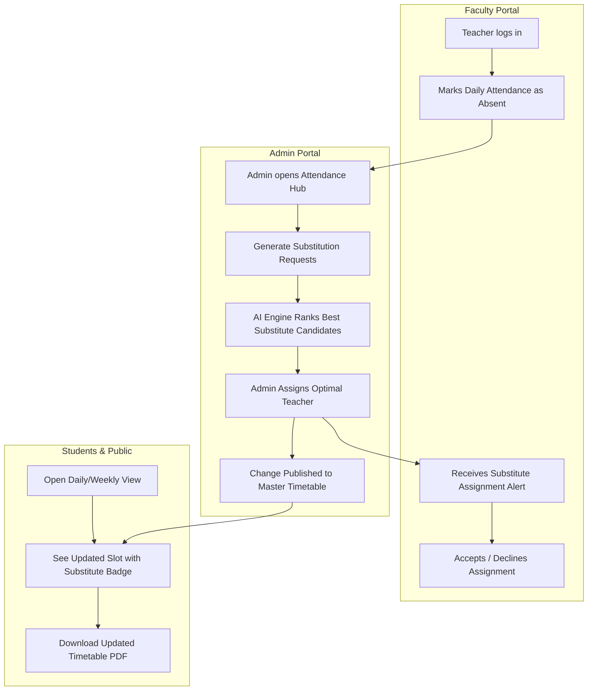

# 🏫 CampusTime — Smart College Timetable & Faculty Substitution System

> An intelligent, full-stack college timetable scheduling and automated faculty substitution management system built with **Node.js, Express, React (Vite), and MySQL**.

---

## 📌 Table of Contents

- [Overview](#-overview)
- [Key Features](#-key-features)
- [System Architecture & Tech Stack](#-system-architecture--tech-stack)
- [Prerequisites](#-prerequisites)
- [Step-by-Step Setup Guide (Any Laptop)](#-step-by-step-setup-guide-any-laptop)
  - [1. Clone / Open the Project](#1-clone--open-the-project)
  - [2. Set Up MySQL Database](#2-set-up-mysql-database)
  - [3. Configure & Start Backend](#3-configure--start-backend)
  - [4. Configure & Start Frontend](#4-configure--start-frontend)
- [Default Login Credentials](#-default-login-credentials)
- [User Roles & Walkthrough](#-user-roles--walkthrough)
- [API Endpoints Reference](#-api-endpoints-reference)
- [Project Directory Structure](#-project-directory-structure)
- [Troubleshooting & FAQs](#-troubleshooting--faqs)

---

## 🚀 Overview

**CampusTime** streamlines academic scheduling and resolves daily teacher absenteeism bottlenecks. When a faculty member is absent or on leave, the system automatically identifies affected classes and uses an **AI/Rule-Based Recommendation Engine** to suggest the best available substitute teachers based on subject expertise, workload balance, and timetable availability.

---

## ✨ Key Features

### 🎓 1. Public Timetable Portal (Students & Visitors)
- **Live Daily Timetable**: Filter schedules by Course (e.g., BCA), Academic Year (FY, SY, TY), Section (A, B), and Batch (Batch 1, 2, 3).
- **Weekly Master Schedule**: Comprehensive multi-day timetable grid view.
- **Dynamic PDF Downloads**: Instant, server-generated daily and weekly timetable PDF exports.
- **Live Substitution Badges**: Highlights rescheduled, substituted, or cancelled lectures with clear visual status tags.

### 👨‍🏫 2. Faculty / Teacher Portal
- **Secure Authentication**: Role-based JWT authentication.
- **Personalized Schedule Dashboard**: View today's classes and full weekly teaching commitments.
- **Attendance Self-Reporting**: Mark daily status as *Present*, *Absent*, or *On Leave* with optional reason notes.
- **Substitution Request Manager**: View incoming substitution assignments, check details, and *Accept* or *Decline* with remarks.

### 🛡️ 3. Admin Management Portal
- **Central Analytics Dashboard**: Real-time KPI counters for daily active slots, scheduled substitutes, attendance stats, and pending alerts.
- **Faculty Attendance Hub**: View all teacher reports and batch-generate substitution requests for absent faculty with one click.
- **Smart Substitution Recommendation Engine**:
  - Automatically filters candidates with strict hard constraints (no class collision, room availability, subject qualifications).
  - Ranks candidates with heuristic scoring (daily teaching load, free hours, recent substitution burden).
- **Assignment & Notification Engine**: Directly assign substitutes and notify affected teachers.
- **Audit Logs & History**: Immutable audit log of all timetable alterations, approvals, and substitutions.

---

## 🛠️ System Architecture & Tech Stack

```
Smart-Time-Table-Generator/
├── backend/          # Express.js API, JWT Auth, MySQL2, PDFKit, Recommendation Engine
└── frontend/         # React 18 SPA, Vite, React Router 6, Axios, Vanilla CSS System
```

| Layer | Technology | Description |
|---|---|---|
| **Frontend** | React 18, Vite | Fast SPA with component-driven architecture |
| **Routing** | React Router v6 | Client-side routing with role-based route guards |
| **Styling** | Vanilla Modern CSS | Responsive layout, dark/light aesthetics, glassmorphism |
| **Backend API** | Node.js & Express | RESTful API server with modular controllers & services |
| **Database** | MySQL 8.x / 5.7 / MariaDB | Relational schema with foreign keys and cascading updates |
| **Authentication** | JWT & Bcrypt.js | Secure password hashing & bearer token authentication |
| **PDF Generation** | PDFKit | Vector-quality dynamic timetable export |

---

## 📋 Prerequisites

Before running this project on your laptop, ensure you have the following installed:

1. **Node.js** (v18.x or v20.x or higher) — [Download Node.js](https://nodejs.org/)
2. **npm** (comes bundled with Node.js)
3. **MySQL Server** (v8.0+, MariaDB, or via **XAMPP / WAMP / MySQL Workbench**)
   - Ensure your MySQL service is running on port `3306`.
4. **Git** (optional, for cloning)

---

## 💻 Step-by-Step Setup Guide (Any Laptop)

Follow these exact steps to run the complete project locally on Windows, macOS, or Linux.

---

### 1. Clone / Open the Project

Open your terminal or command prompt (PowerShell / Bash) and navigate to the project root:

```bash
# Clone the repository (if not already downloaded)
git clone https://github.com/tuhin-ghorui/Smart-Time-Table-Generator.git

# Navigate into the project folder
cd Smart-Time-Table-Generator
```

---

### 2. Set Up MySQL Database

1. Start your **MySQL Server** (via MySQL Workbench, Windows Services, XAMPP Control Panel, or terminal).
2. Note your MySQL `root` password (e.g. `root`, `password`, `Admin@123`, or empty `""`).

> **Note**: You do **not** need to manually create the database tables. The automated setup scripts in Step 3 will create the `campustime` database, tables, and demo data for you!

---

### 3. Configure & Start Backend

Open a terminal window and navigate into the `backend` folder:

```bash
cd backend
```

#### Step 3.1: Install Backend Dependencies
```bash
npm install
```

#### Step 3.2: Configure Environment Variables
Inside the `backend/` folder, check the `.env` file (or copy from `.env.example`):

```bash
# If .env does not exist, copy from .env.example:
# Windows PowerShell:
copy .env.example .env

# macOS / Linux:
cp .env.example .env
```

Open `backend/.env` in your text editor and ensure the database credentials match your local MySQL server:

```env
PORT=5000

DB_HOST=localhost
DB_PORT=3306
DB_USER=root
DB_PASSWORD=YOUR_MYSQL_PASSWORD_HERE
DB_NAME=campustime

JWT_SECRET=campustime_super_secret_jwt_key_2026
JWT_EXPIRES_IN=7d
```

> ⚠️ **Important**: Replace `YOUR_MYSQL_PASSWORD_HERE` with your actual MySQL root password.

#### Step 3.3: Initialize Schema & Seed Demo Data
Run the built-in database migration and seeder scripts:

```bash
# 1. Create database and tables:
npm run db:schema

# 2. Populate demo users, courses, subjects, slots, and substitution requests:
npm run seed
```

*(Tip: If you ever want to wipe and re-seed clean data, run `npm run seed:reset`)*

#### Step 3.4: Start Backend Server
```bash
# For development mode with auto-reload:
npm run dev

# Or for standard start:
npm start
```

You should see:
```
CampusTime API running on http://localhost:5000
```
Keep this terminal window running.

---

### 4. Configure & Start Frontend

Open a **new, separate terminal window** and navigate to the `frontend` folder:

```bash
cd Smart-Time-Table-Generator/frontend
```

#### Step 4.1: Install Frontend Dependencies
```bash
npm install
```

#### Step 4.2: Start the Vite Dev Server
```bash
npm run dev
```

You should see output similar to:
```
  VITE v5.4.8  ready in 240 ms

  ➜  Local:   http://localhost:5173/
  ➜  Network: use --host to expose
```

#### Step 4.3: Open in Browser
Open your browser and navigate to:
👉 **[http://localhost:5173](http://localhost:5173)**

---

## 🔑 Default Login Credentials

The seeder populates the database with pre-configured accounts:

### 🛡️ Administrator Account
| Attribute | Value |
|---|---|
| **URL** | [http://localhost:5173/login](http://localhost:5173/login) |
| **Email** | `admin@campustime.test` |
| **Password** | `admin123` |
| **Role** | System Administrator |

### 👨‍🏫 Faculty / Teacher Accounts
| Name | Email | Password |
|---|---|---|
| Prof. Rajesh Kumar | `teacher1@campustime.test` | `teacher123` |
| Prof. Sunita Sharma | `teacher2@campustime.test` | `teacher123` |
| Prof. Arjun Mehta | `teacher3@campustime.test` | `teacher123` |
| Prof. Neha Patel | `teacher4@campustime.test` | `teacher123` |
| Prof. Vikram Singh | `teacher5@campustime.test` | `teacher123` |
| Prof. Priya Nair | `teacher6@campustime.test` | `teacher123` |
| Prof. Sameer Joshi | `teacher7@campustime.test` | `teacher123` |
| Prof. Kavita Desai | `teacher8@campustime.test` | `teacher123` |

### 🌐 Public Portal (No login required)
- **Daily View**: [http://localhost:5173/](http://localhost:5173/)
- **Weekly Master View**: [http://localhost:5173/week](http://localhost:5173/week)

---

## 🔄 User Roles & Typical Workflow



1. **Teacher reports Absence**: Prof. Rajesh logs in and marks status as `absent`.
2. **Admin Generates Request**: Admin navigates to `/admin/attendance`, views absences, and clicks **"Generate Requests"**.
3. **AI Recommendation**: Admin inspects the open request. The system evaluates all free faculty, checks subject competencies, calculates workload scores, and displays ranked candidate recommendations.
4. **Admin Assigns**: Admin selects the top-ranked teacher and sends the assignment.
5. **Teacher Confirms**: The substitute teacher reviews and accepts the slot.
6. **Public View Updates**: The public timetable updates dynamically, displaying the substitute teacher and status tag.

---

## 📡 API Endpoints Reference

### Public Endpoints (`/api/public`)
- `GET /api/public/structure` — Fetch academic structure (courses, years, sections, batches).
- `GET /api/public/timetable?course_id=&year_id=&section_id=&batch_id=&date=` — Filtered daily timetable.
- `GET /api/public/timetable/week?course_id=&year_id=&section_id=&batch_id=` — Weekly master timetable grid.
- `GET /api/public/changes?limit=20` — Recent timetable changes & adjustments.
- `GET /api/public/pdf/daily` — Download daily timetable PDF.
- `GET /api/public/pdf/weekly` — Download weekly timetable PDF.

### Authentication (`/api/auth`)
- `POST /api/auth/login` — Authenticate user and return JWT token.
- `GET /api/auth/me` — Return currently logged-in user profile.

### Teacher Endpoints (`/api/teacher`) *(Bearer Token Required)*
- `GET /api/teacher/dashboard` — Summary of today's classes and substitution count.
- `POST /api/teacher/attendance` — Self-report attendance (`present`, `absent`, `leave`).
- `GET /api/teacher/schedule` — Teacher's personal weekly teaching schedule.
- `GET /api/teacher/assignments` — Pending and past substitution requests.
- `POST /api/teacher/assignments/:id/respond` — Accept or decline an assignment (`action: 'accept' | 'decline'`).

### Admin Endpoints (`/api/admin`) *(Bearer Token with Admin Role Required)*
- `GET /api/admin/dashboard` — System KPIs, pending alerts, and metrics.
- `GET /api/admin/attendance?date=` — Daily attendance overview across all faculty.
- `POST /api/admin/attendance/generate-requests` — Automatically create substitution tickets for absent teachers.
- `GET /api/admin/requests` — List all open/filled substitution requests.
- `GET /api/admin/requests/:id` — Request details along with AI candidate recommendations.
- `POST /api/admin/assignments` — Assign a substitute teacher to a request.
- `GET /api/admin/history` — Audit trail of all timetable changes.

---

## 📂 Project Directory Structure

```
Smart-Time-Table-Generator/
├── backend/
│   ├── config/
│   │   └── db.js                 # MySQL connection pool configuration
│   ├── database/
│   │   ├── schema.sql            # Relational database table definitions
│   │   ├── load-schema.js        # Script to apply schema.sql
│   │   └── seed.js               # Database seeder with sample data
│   ├── middlewares/
│   │   └── auth.js               # JWT verification & role authorization middleware
│   ├── routes/
│   │   ├── auth.routes.js        # Login & profile routes
│   │   ├── public.routes.js      # Public schedule & PDF generation routes
│   │   ├── teacher.routes.js     # Teacher dashboard & attendance routes
│   │   └── admin.routes.js       # Admin substitution & management routes
│   ├── services/
│   │   ├── ai.service.js         # Smart rule-based substitution ranking engine
│   │   ├── audit.service.js      # Audit log recording service
│   │   ├── notify.service.js     # System notification dispatcher
│   │   └── pdf.service.js        # PDFKit dynamic document generator
│   ├── utils/
│   │   └── helpers.js            # Time overlap & date utility functions
│   ├── .env.example              # Environment variables template
│   ├── package.json              # Backend dependencies & npm scripts
│   └── server.js                 # Express application entry point
│
├── frontend/
│   ├── public/
│   ├── src/
│   │   ├── components/
│   │   │   ├── Layout.jsx        # Authenticated layout with navigation
│   │   │   ├── PublicLayout.jsx  # Public header & container layout
│   │   │   ├── StructureSelector.jsx # Dynamic Course/Year/Section dropdowns
│   │   │   ├── SlotRow.jsx       # Timetable slot visual card
│   │   │   ├── PdfButton.jsx     # PDF export action button
│   │   │   └── ui.jsx            # Reusable UI components (Modals, Badges, Cards)
│   │   ├── context/
│   │   │   └── AuthContext.jsx   # Global user state & authentication provider
│   │   ├── pages/
│   │   │   ├── Login.jsx         # User login screen
│   │   │   ├── admin/
│   │   │   │   ├── AdminDashboard.jsx  # Admin overview & KPIs
│   │   │   │   ├── Attendance.jsx      # Faculty attendance & request generator
│   │   │   │   ├── Substitutions.jsx   # AI candidate selector & assignment
│   │   │   │   └── History.jsx         # Change history & audit log
│   │   │   ├── public/
│   │   │   │   ├── PublicTimetable.jsx # Interactive daily timetable viewer
│   │   │   │   └── PublicWeek.jsx      # Weekly timetable grid viewer
│   │   │   └── teacher/
│   │   │       ├── TeacherDashboard.jsx   # Teacher homepage & quick attendance
│   │   │       ├── TeacherSchedule.jsx    # Teacher's personal schedule
│   │   │       └── TeacherAssignments.jsx # Substitution accept/decline inbox
│   │   ├── api.js                # Axios HTTP client with auth interceptors
│   │   ├── App.jsx               # Application routes & layout bindings
│   │   ├── main.jsx              # React DOM entry point
│   │   └── styles.css            # Master stylesheet
│   ├── index.html
│   ├── package.json              # Frontend dependencies & npm scripts
│   └── vite.config.js            # Vite configuration with API proxy to port 5000
│
└── README.md                     # Project documentation & setup guide
```

---

## ❓ Troubleshooting & FAQs

### 1. `Error: connect ECONNREFUSED 127.0.0.1:3306`
- **Cause**: MySQL server is not running on your laptop.
- **Fix**: Open Windows Services (or XAMPP) and start the **MySQL** service. Verify it is listening on port `3306`.

### 2. `ER_ACCESS_DENIED_ERROR` when running `npm run db:schema`
- **Cause**: Incorrect MySQL username or password in `backend/.env`.
- **Fix**: Open `backend/.env` and update `DB_PASSWORD=` with your actual MySQL password.

### 3. Frontend says `Network Error` or `404` when making requests
- **Cause**: Backend server is not running or proxy issue.
- **Fix**: Ensure the backend is active at `http://localhost:5000`. The frontend Vite dev server automatically proxies `/api/*` requests to port `5000`.

### 4. How to wipe data and reseed from scratch?
Run in the `backend/` directory:
```bash
npm run seed:reset
```

### 5. Can I run on different ports?
- To change backend port, modify `PORT=5000` in `backend/.env` and update `target: 'http://localhost:<NEW_PORT>'` in `frontend/vite.config.js`.

---

## 📜 License
This project is created for academic and development purposes under the **MIT License**.
